# DoxIn - Production Architecture (GCP)

> **Scalable, cloud-native invoice processing system with AI chatbot on Google Cloud Platform**

## Table of Contents

1. [System Overview](#system-overview)
2. [Infrastructure Architecture](#infrastructure-architecture)
3. [Service Architecture](#service-architecture)
4. [Data Architecture](#data-architecture)
5. [AI & ML Architecture](#ai--ml-architecture)
6. [Security Architecture](#security-architecture)
7. [Deployment Architecture](#deployment-architecture)
8. [Monitoring & Observability](#monitoring--observability)

---

## System Overview

### High-Level Architecture

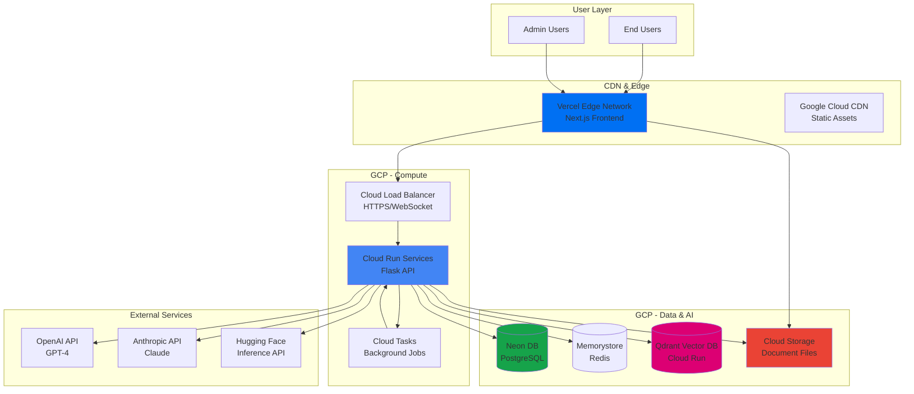

### System Capabilities

1. **Invoice Processing**
   - AI-powered document extraction
   - Real-time WebSocket updates
   - Batch processing support

2. **AI Chatbot Assistant**
   - Natural language queries
   - RAG (Retrieval-Augmented Generation)
   - Text-to-SQL capabilities
   - Streaming responses

3. **Analytics & Reporting**
   - Custom report generation
   - Data visualization
   - Export capabilities

---

## Infrastructure Architecture

### GCP Resource Topology

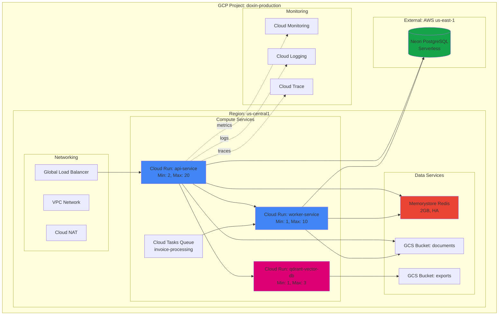

### Service Specifications

| Service | Type | Scaling | CPU | Memory | Storage |
|---------|------|---------|-----|--------|---------|
| **api-service** | Cloud Run | 2-20 instances | 2 vCPU | 4GB | N/A |
| **worker-service** | Cloud Run | 1-10 instances | 1 vCPU | 2GB | N/A |
| **qdrant-vector-db** | Cloud Run | 1-3 instances | 2 vCPU | 8GB | 50GB SSD |
| **memorystore-redis** | Managed | N/A | N/A | 2GB | N/A |
| **neon-db** | External | Auto | N/A | N/A | 100GB |
| **documents-bucket** | GCS | N/A | N/A | N/A | Unlimited |

---

## Service Architecture

### API Service Architecture

```mermaid
graph LR
    subgraph "Cloud Run: api-service"
        direction TB
        API[Flask API<br/>Port 8000]

        subgraph "Route Handlers"
            AuthR[/auth/*<br/>Authentication]
            InvR[/invoices/*<br/>Invoice CRUD]
            JobsR[/jobs/*<br/>Job Tracking]
            ChatR[/chat/*<br/>AI Chatbot]
            ReportR[/reports/*<br/>Analytics]
            AdminR[/admin/*<br/>Admin Panel]
        end

        subgraph "Services Layer"
            LLM[LLM Service<br/>OpenAI/Anthropic]
            Chat[Chat Service<br/>Streaming]
            RAG[RAG Service<br/>Vector Search]
            SQL[Text-to-SQL<br/>Generator]
            WS[WebSocket Manager<br/>Real-time Updates]
        end

        API --> AuthR & InvR & JobsR & ChatR & ReportR & AdminR
        ChatR --> Chat
        Chat --> LLM & RAG & SQL
        InvR --> LLM & WS
        JobsR --> WS
    end

    Chat --> Redis[(Redis Cache)]
    RAG --> Qdrant[(Qdrant)]
    SQL --> Neon[(Neon DB)]

    style API fill:#4285f4
    style Chat fill:#34a853
    style RAG fill:#dc0073
```

### Chat Service Flow

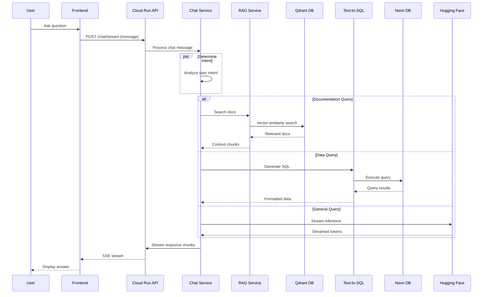

---

## Data Architecture

### Database Schema Overview

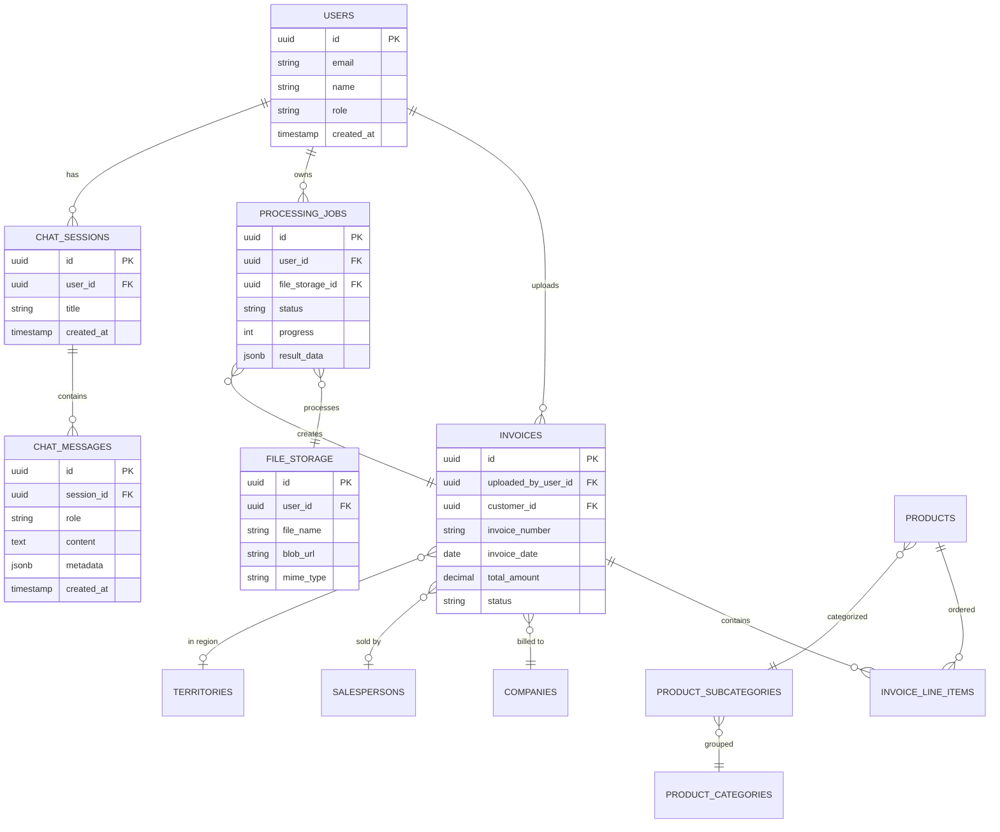

### Data Flow Architecture

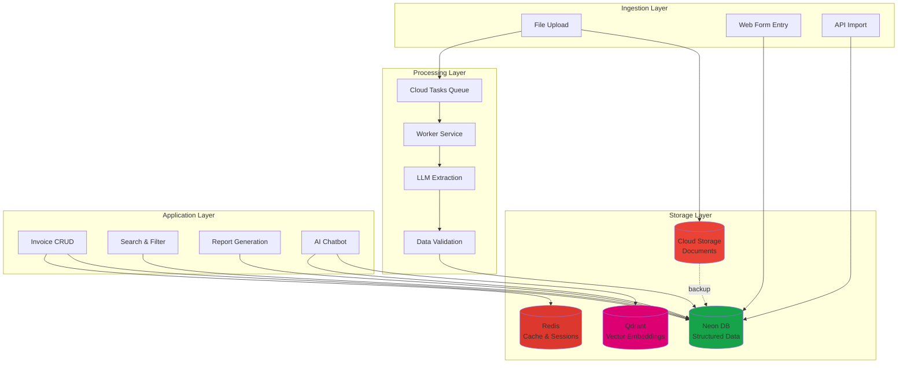

---

## AI & ML Architecture

### AI Services Stack

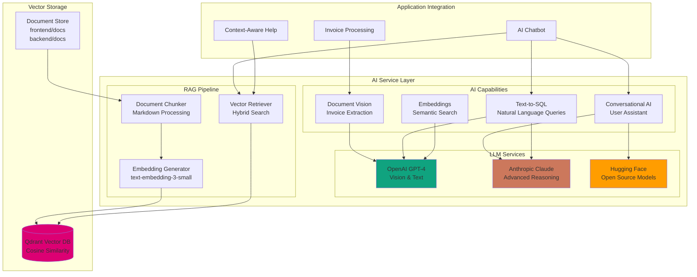

### RAG (Retrieval-Augmented Generation) Pipeline

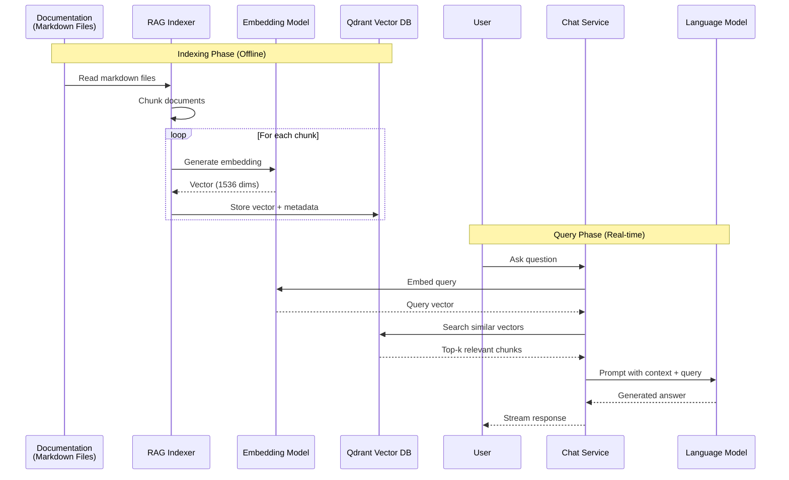

### Qdrant Collection Schema

```yaml
collections:
  - name: "documentation"
    vectors:
      size: 1536  # OpenAI text-embedding-3-small
      distance: Cosine

    payload_schema:
      source: string       # "frontend/docs" or "backend/docs"
      filename: string     # e.g., "API_DOCUMENTATION.md"
      title: string        # Document title
      chunk_index: integer # Position in document
      content: text        # Actual text chunk
      metadata: object     # Additional context
      created_at: timestamp

  - name: "invoice_descriptions"
    vectors:
      size: 1536
      distance: Cosine

    payload_schema:
      invoice_id: string
      company_name: string
      line_items: array
      semantic_tags: array
```

---

## Security Architecture

### Authentication & Authorization Flow

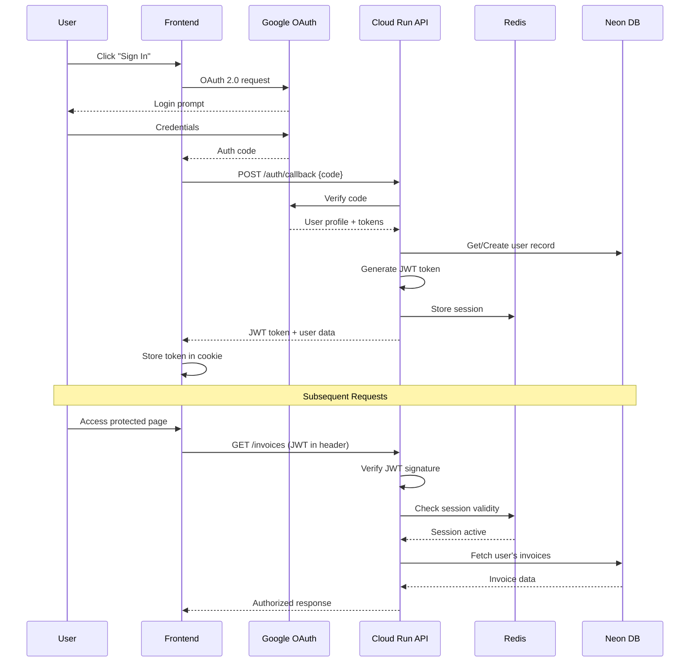

### Security Layers

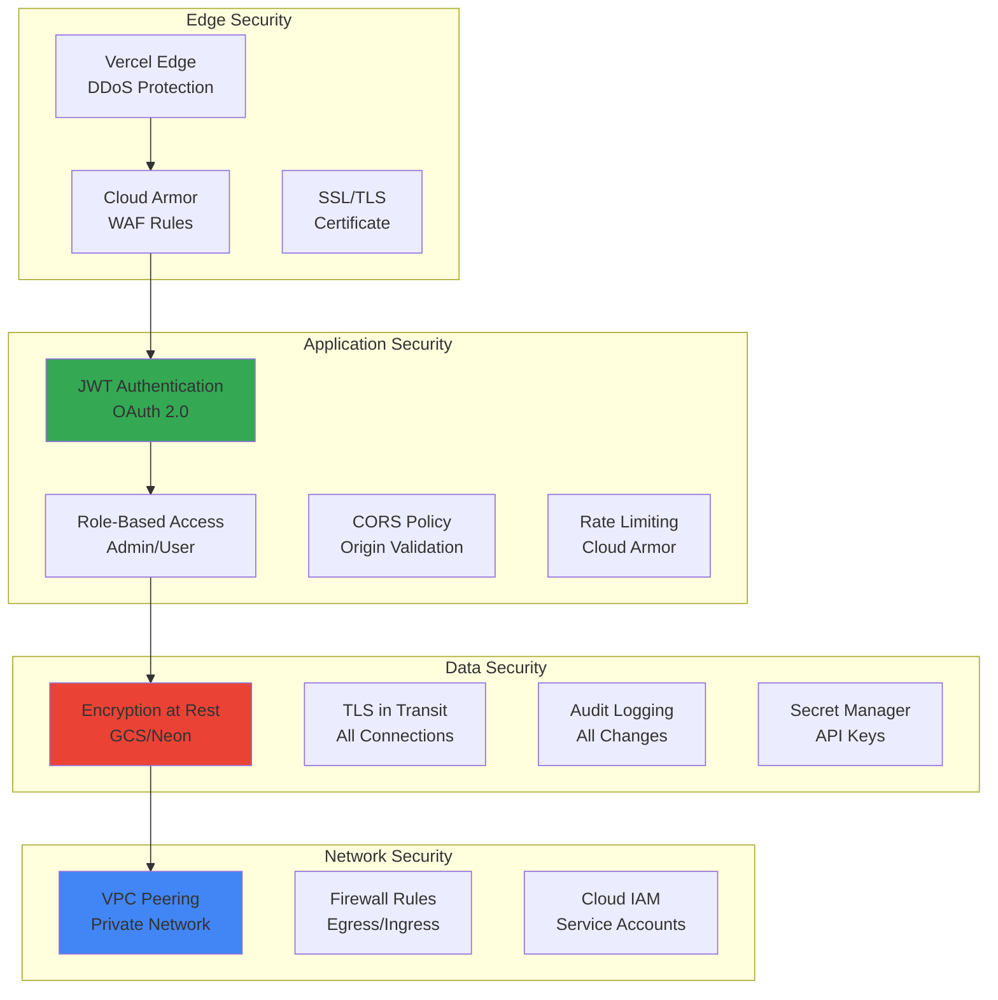

---

## Deployment Architecture

### CI/CD Pipeline

```mermaid
graph LR
    subgraph "Source Control"
        GH[GitHub Repository<br/>main branch]
    end

    subgraph "CI Pipeline - GitHub Actions"
        Test[Run Tests<br/>pytest, jest]
        Lint[Code Quality<br/>pylint, eslint]
        Build[Build Images<br/>Docker]
    end

    subgraph "Artifact Registry"
        GAR[Google Artifact Registry<br/>us-central1]
    end

    subgraph "CD Pipeline"
        Deploy[Deploy to Cloud Run<br/>Blue-Green]
        Migrate[Run Migrations<br/>Alembic]
        Smoke[Smoke Tests<br/>Health Checks]
    end

    subgraph "Production Environment"
        CR1[Cloud Run: api-service<br/>Revision: abc123]
        CR2[Cloud Run: worker-service<br/>Revision: def456]
        CR3[Cloud Run: qdrant<br/>Revision: ghi789]
    end

    GH -->|Push| Test
    Test --> Lint
    Lint --> Build
    Build --> GAR
    GAR --> Deploy
    Deploy --> Migrate
    Migrate --> Smoke
    Smoke -->|Success| CR1 & CR2 & CR3
    Smoke -->|Failure| Deploy

    style GH fill:#181717
    style GAR fill:#4285f4
    style CR1 fill:#34a853
```

### Multi-Environment Strategy

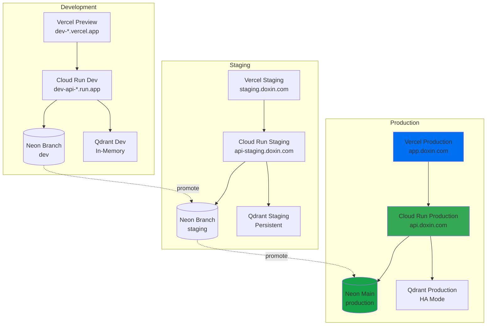

---

## Monitoring & Observability

### Observability Stack

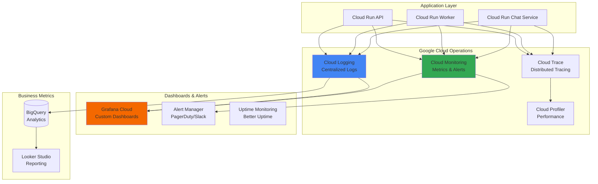

### Key Metrics & Alerts

```yaml
metrics:
  api_service:
    - request_rate: requests/second
    - request_latency_p95: milliseconds
    - error_rate: 4xx/5xx errors
    - concurrent_connections: active WebSocket connections

  worker_service:
    - job_queue_depth: pending jobs
    - job_processing_time: seconds
    - job_success_rate: percentage

  qdrant_service:
    - vector_search_latency: milliseconds
    - collection_size: number of vectors
    - memory_usage: GB

  database:
    - connection_pool_usage: percentage
    - query_latency_p95: milliseconds
    - active_connections: count
    - storage_usage: GB

alerts:
  critical:
    - name: "API Service Down"
      condition: "health_check_failures > 3"
      channel: "pagerduty"

    - name: "Database Connection Pool Exhausted"
      condition: "connection_pool_usage > 90%"
      channel: "pagerduty"

  warning:
    - name: "High Error Rate"
      condition: "error_rate > 5%"
      channel: "slack"

    - name: "Slow Response Time"
      condition: "request_latency_p95 > 1000ms"
      channel: "slack"
```

---

## Cost Optimization

### Resource Cost Breakdown (Monthly Estimate)

| Service | Usage | Cost |
|---------|-------|------|
| **Cloud Run (API)** | 2-20 instances, 2vCPU, 4GB | $150-$800 |
| **Cloud Run (Worker)** | 1-10 instances, 1vCPU, 2GB | $50-$300 |
| **Cloud Run (Qdrant)** | 1-3 instances, 2vCPU, 8GB | $100-$250 |
| **Memorystore Redis** | 2GB, HA | $50 |
| **Neon Database** | 100GB, 200 compute hours | $69 |
| **Cloud Storage** | 1TB, 1M operations | $26 |
| **Cloud Load Balancer** | 1TB egress | $25 |
| **Cloud Logging** | 50GB | $25 |
| **Cloud Monitoring** | Custom metrics | $10 |
| **Vercel** | Pro Plan | $20 |
| **OpenAI API** | 10M tokens | $100-$200 |
| **Total** | | **$625-$1,905/month** |

### Scaling Strategy

```yaml
autoscaling:
  api_service:
    min_instances: 2  # High availability
    max_instances: 20
    target_cpu_utilization: 70%
    target_concurrency: 100
    scale_down_delay: 5m

  worker_service:
    min_instances: 1
    max_instances: 10
    target_cpu_utilization: 80%
    queue_depth_threshold: 50

  qdrant_service:
    min_instances: 1  # Can be 0 for dev
    max_instances: 3
    target_memory_utilization: 75%
```

---

## Architecture Decision Records

### ADR-001: GCP over Azure for Production

**Status**: Accepted

**Context**: Need cloud platform for production deployment.

**Decision**: Use Google Cloud Platform instead of Azure.

**Rationale**:
- Better Cloud Run pricing and scaling model
- Superior global load balancing
- More cost-effective Memorystore Redis
- Excellent integration with Vercel
- Better cold start times

**Consequences**:
- Migration from Azure-focused documentation
- New IAM and networking setup
- Team needs GCP training

### ADR-002: Neon Database for PostgreSQL

**Status**: Accepted

**Context**: Need scalable, serverless PostgreSQL database.

**Decision**: Use Neon serverless PostgreSQL.

**Rationale**:
- Serverless scaling (scale to zero)
- Branch-based development workflow
- Excellent connection pooling
- Cost-effective for variable workloads
- PostgreSQL compatibility

**Consequences**:
- Cross-cloud latency (Neon on AWS, API on GCP)
- Connection pooling critical
- Need monitoring for connection limits

### ADR-003: Qdrant for Vector Database

**Status**: Accepted

**Context**: Need vector database for RAG and semantic search.

**Decision**: Self-host Qdrant on Cloud Run.

**Rationale**:
- Open source, no vendor lock-in
- Excellent performance for our scale
- Can run in container on Cloud Run
- Cost-effective vs. managed alternatives
- Rich filtering and hybrid search

**Consequences**:
- Need to manage persistence (GCS volumes)
- Manual backup strategy
- Scaling requires monitoring

### ADR-004: Hugging Face for AI Inference Streaming

**Status**: Accepted

**Context**: Need streaming AI inference for chatbot responses.

**Decision**: Use Hugging Face Inference API for streaming alongside OpenAI/Anthropic.

**Rationale**:
- Open source model options
- Cost-effective for high volume
- True streaming support
- Can self-host if needed
- Good latency from Europe

**Consequences**:
- Multiple AI providers to manage
- Fallback logic needed
- Different rate limits per provider

---

## Next Steps

1. **Phase 1: Infrastructure Setup** (Week 1-2)
   - Create GCP project and enable APIs
   - Set up VPC network and Cloud NAT
   - Deploy Memorystore Redis
   - Configure Neon database

2. **Phase 2: Core Services** (Week 3-4)
   - Deploy Cloud Run API service
   - Deploy Cloud Run worker service
   - Set up Cloud Tasks queue
   - Configure Cloud Storage buckets

3. **Phase 3: AI Features** (Week 5-6)
   - Deploy Qdrant vector database
   - Implement RAG pipeline
   - Build chat service endpoints
   - Index documentation

4. **Phase 4: Monitoring & Production** (Week 7-8)
   - Configure Cloud Operations
   - Set up alerting
   - Performance testing
   - Production launch

---

**Document Version**: 1.0
**Last Updated**: 2025-10-20
**Maintained By**: Platform Team
